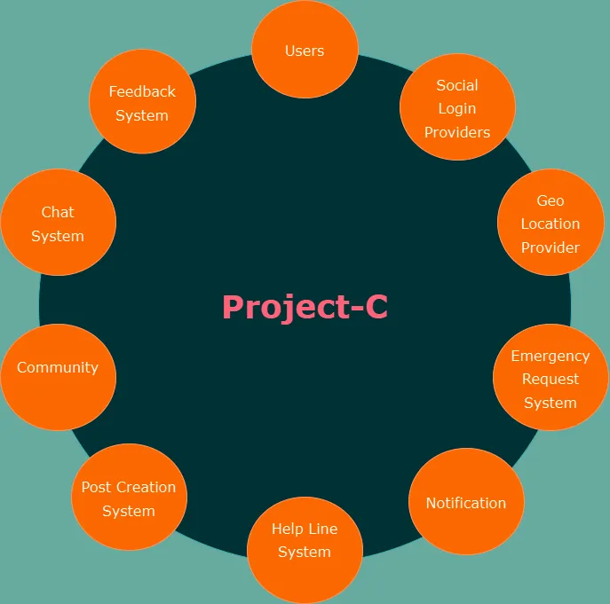

# System Scope and Context
 
## System Scope

The system is a web application designed to allow users to post and address social issues. The primary functionalities include:

- Social login for easy and secure access.

- Theme customization for improved user experience.

- Auto geolocation to identify the user's location for contextually relevant posts.

- Post creation to raise social issues.

- Emergency posts for urgent concerns.

- Helpline integration for direct assistance.

- Feedback collection for continual improvement.

- Language localization for a diverse audience.

- Community interaction through discussions and chat features.
 
### In-Scope

- Facilitating the creation and management of posts related to social issues.

- Geolocation-based services for location-specific relevance.

- User engagement through features like community discussions and feedback mechanisms.

- Support for emergency responses via helplines and urgent post tagging.
 
### Out-of-Scope

- Direct resolution of social issues (handled by NGOs or authorities).

- Moderation of all content (community-driven reporting or automated moderation tools may assist).
 
---
 
## Business Context

This system addresses the growing need for an inclusive and accessible platform to:

- Enable individuals and communities to raise awareness about social issues.

- Empower users to collaborate, propose solutions, and engage with authorities or NGOs.

- Foster community trust and interaction through modern digital tools.
 
### Target Users

- Individuals or groups affected by social issues.

- Community leaders, activists, and volunteers.

- Organizations or authorities addressing social problems.
 
### Purpose

- Provide a centralized platform for raising and resolving social issues.

- Empower communities through collaborative engagement.

- Enhance accessibility and inclusivity with features like localization and geolocation.
 
### Core Business Goals

- Enable efficient reporting and tracking of social issues, including emergencies.

- Promote transparency and trust with interactive features like chat and community posts.

- Support organizations in resolving issues more effectively.
 
### Value Proposition

- **Accessibility**: Multi-language support and geolocation make the platform usable for diverse audiences.

- **Engagement**: Features like social login, community chat, and themes drive user participation.

- **Support Systems**: Emergency posts, helplines, and feedback tools enhance user experience.
 
### Stakeholders

- Developers and administrators managing the platform.
 
---
 
## System Interfaces

The system integrates with several external services and tools:

- **Social Login Providers**: For secure and seamless user authentication.

- **Geolocation Services**: To determine user location for context-based services.

- **Chat and Messaging Systems**: For real-time user interaction.

- **Emergency Helplines**: Integration with third-party services for urgent responses.
 
---
 
## Context Diagram

 
# Elements and Descriptions

| Element                                      | Description                                                                                      | Input                                                                                                                                    | Output                                                                                                 |
|----------------------------------------------|--------------------------------------------------------------------------------------------------|-------------------------------------------------------------------------------------------------------------------------------------------|--------------------------------------------------------------------------------------------------------|
| Social Login (Passkey & OAuth)               | Secure, convenient login using Passkey (WebAuthn) or OAuth (e.g., Google).                       | User-initiated login attempts via browser/device authenticators (Passkey) or OAuth redirect URLs.                                        | Authentication tokens (JWT), user profile data from external provider, and a logged-in user session.     |
| Theme (Local State Provider)                 | Allows the user to choose and store UI theme preferences locally.                                | User-selected theme options (e.g., dark/light mode, color schemes) stored in the local application state.                                | A personalized UI appearance applied to the user's session, persisting across sessions if stored locally.|
| Auto Geolocation (OSM & Leaflet)             | Identifies user’s location for relevant content using OpenStreetMap & Leaflet.                   | User’s device location data (GPS coordinates) or IP-based lookups integrated via the frontend with OSM/Leaflet libraries.                 | Geocoded address/region data displayed on the frontend, enabling location-based filtering of posts/feeds.|
| Post Creation (Backend API Service)          | Lets users create posts via a backend API.                                                       | User-submitted post content (text, images, metadata) sent to a backend POST endpoint.                                                     | Successfully stored post (post ID), confirmation message, and updated feed data retrieved from the API.   |
| Emergency Posts (Backend API Service)        | Specialized urgent posts created via a backend service.                                           | User-submitted emergency posts (type of emergency, location) sent to the API.                                                            | Confirmation of urgent post storage, triggered alerts/notifications, highlighted emergency posts in feeds.|
| Helpline Integration (3rd Party Service)     | Connects users to external emergency contacts.                                                   | User queries for help resources (e.g., category, location) sent to a third-party helpline service API.                                    | A list of helpline contacts, emergency numbers, or assistance links returned from the external service.   |
| Feedback Collection (Backend API)            | Collects and stores user feedback via a backend API.                                              | User feedback submissions (ratings, comments) sent to feedback API endpoints.                                                            | Stored feedback entries, acknowledgements (e.g., “Feedback received”), aggregated data for improvement.   |
| Language Localization (Local State & CDN)    | Provides localized UI text & resources.                                                          | User’s language preference (detected from browser or user selection) and requests for localized assets from CDN.                         | Translated UI strings and resources applied in the frontend via local state management, ensuring a localized experience.             |
| Community Interaction (Third Party Services) | Supports discussions, forums, and community features.                                             | User actions (join community, post in forum) sent to third-party community services APIs.                                                | Responses indicating updated community membership, new discussion threads, or community-specific feeds.   |
| Chat System (Third Party Service)            | Real-time messaging and group chat features.                                                     | User’s chat messages, attachments, and presence signals sent to an external chat service API.                                            | Delivered messages, updated chat histories, typing indicators, and presence notifications from the chat service. |
| Users (Login, Register, Forgot Password)      | Core user account management via backend service.                                                 | User credentials (email/password), registration data, password reset requests to backend user endpoints.                                 | Authenticated sessions, user profiles, password reset confirmations, and user detail retrieval responses. |
