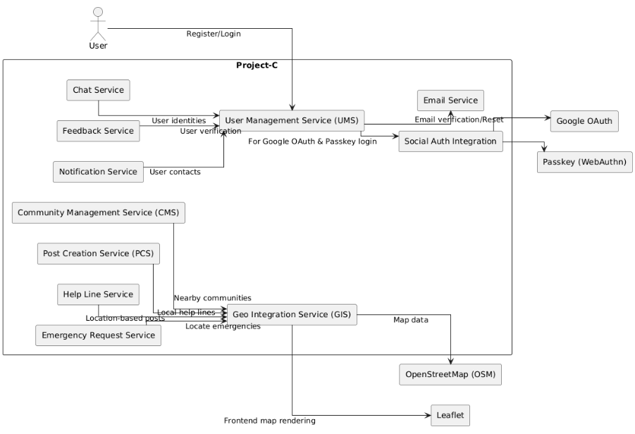

# Building Block View

## Diagram

Below is the building block view:



## UML Code

Below is the building block view UML Code:

```plantuml
@startuml
left to right direction
skinparam packageStyle rectangle
skinparam shadowing false
skinparam linetype ortho

actor "User" as user

rectangle "Project-C" as ProjectC {
  rectangle "User Management Service (UMS)" as UMS
  rectangle "Community Management Service (CMS)" as CMS
  rectangle "Post Creation Service (PCS)" as PCS
  rectangle "Chat Service" as Chat
  rectangle "Feedback Service" as Feedback
  rectangle "Notification Service" as Notification
  rectangle "Help Line Service" as HelpLine
  rectangle "Emergency Request Service" as EmergencyReq
  rectangle "Social Auth Integration" as SocialAuth
  rectangle "Geo Integration Service (GIS)" as GIS
  rectangle "Email Service" as EmailService
}

rectangle "OpenStreetMap (OSM)" as OSM
rectangle "Leaflet" as Leaflet
rectangle "Google OAuth" as GoogleOAuth
rectangle "Passkey (WebAuthn)" as Passkey

user --> UMS : Register/Login
UMS --> EmailService : Email verification/Reset
UMS --> SocialAuth : For Google OAuth & Passkey login
SocialAuth --> GoogleOAuth
SocialAuth --> Passkey

PCS --> GIS : Location-based posts
CMS --> GIS : Nearby communities
EmergencyReq --> GIS : Locate emergencies
HelpLine --> GIS : Local help lines

GIS --> OSM : Map data
GIS --> Leaflet : Frontend map rendering

Notification --> UMS : User contacts
Feedback --> UMS : User verification
Chat --> UMS : User identities

@enduml