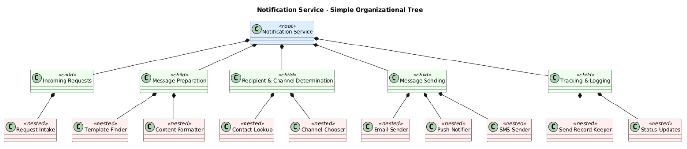

## Notification Service

Below is the building block view:



```plantuml
@startuml
top to bottom direction

skinparam class {
  BackgroundColor&lt;&lt;root&gt;&gt; #DDEEFF
  BackgroundColor&lt;&lt;child&gt;&gt; #EEFFEE
  BackgroundColor&lt;&lt;nested&gt;&gt; #FFEFEF
  BorderColor #000000
  FontColor #000000
  FontName Arial
  FontSize 12
}

title Notification Service - Simple Organizational Tree

class "Notification Service" as Root &lt;&lt;root&gt;&gt; {
  ' Top level: Overall notification handling
  ' Input: Requests from various services
  ' Output: Notifications delivered to end users
}

class "Incoming Requests" as Inbound &lt;&lt;child&gt;&gt; {
  ' Handles incoming notification requests
  ' Input: Raw notification requests
  ' Output: Request details for next steps
}
class "Request Intake" as ReqIntake &lt;&lt;nested&gt;&gt; {
  ' Input: Notification request (who, what message)
  ' Output: Request data for message preparation
}

class "Message Preparation" as Composition &lt;&lt;child&gt;&gt; {
  ' Prepares the message
  ' Input: Notification details
  ' Output: Completed message (formatted)
}
class "Template Finder" as TemplateFinder &lt;&lt;nested&gt;&gt; {
  ' Input: Notification type
  ' Output: Appropriate message template
}
class "Content Formatter" as Formatter &lt;&lt;nested&gt;&gt; {
  ' Input: Template + user/event details
  ' Output: Complete formatted message
}

class "Recipient & Channel Determination" as Routing &lt;&lt;child&gt;&gt; {
  ' Determines recipient contact info and channel
  ' Input: Prepared message + User ID
  ' Output: Chosen channel and contact info
}
class "Contact Lookup" as ContactLookup &lt;&lt;nested&gt;&gt; {
  ' Input: User ID
  ' Output: Contact info (email/phone/token)
}
class "Channel Chooser" as ChannelChooser &lt;&lt;nested&gt;&gt; {
  ' Input: Contact info + preferences
  ' Output: Selected channel (email/push/SMS)
}

class "Message Sending" as Outbound &lt;&lt;child&gt;&gt; {
  ' Sends the notification
  ' Input: Ready message + chosen channel
  ' Output: Delivered notification
}
class "Email Sender" as EmailSender &lt;&lt;nested&gt;&gt; {
  ' Input: Message + email address
  ' Output: Sent email
}
class "Push Notifier" as PushNotifier &lt;&lt;nested&gt;&gt; {
  ' Input: Message + device token
  ' Output: Delivered push notification
}
class "SMS Sender" as SMSSender &lt;&lt;nested&gt;&gt; {
  ' Input: Message + phone number
  ' Output: Sent SMS message
}

class "Tracking & Logging" as Tracking &lt;&lt;child&gt;&gt; {
  ' Logs notifications and handles status updates
  ' Input: Delivery details, status reports
  ' Output: Updated logs and reports
}
class "Send Record Keeper" as RecordKeeper &lt;&lt;nested&gt;&gt; {
  ' Input: Delivery details (recipient, time, channel)
  ' Output: Saved record
}
class "Status Updates" as StatusUpdates &lt;&lt;nested&gt;&gt; {
  ' Input: Delivery confirmations/failures
  ' Output: Updated logs, reports for analysis
}

' Hierarchy (Parent -> Child)
Root *-- Inbound
Inbound *-- ReqIntake

Root *-- Composition
Composition *-- TemplateFinder
Composition *-- Formatter

Root *-- Routing
Routing *-- ContactLookup
Routing *-- ChannelChooser

Root *-- Outbound
Outbound *-- EmailSender
Outbound *-- PushNotifier
Outbound *-- SMSSender

Root *-- Tracking
Tracking *-- RecordKeeper
Tracking *-- StatusUpdates

@enduml
